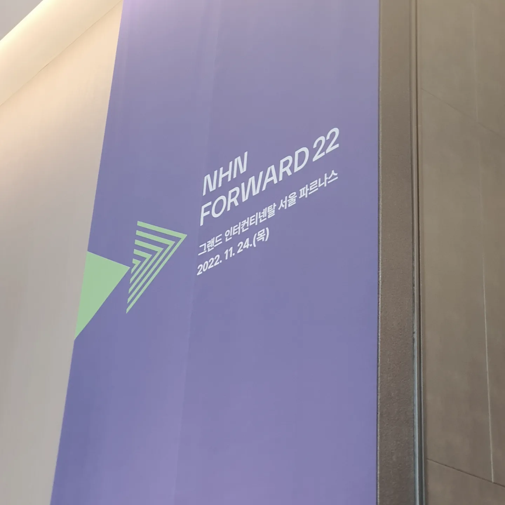
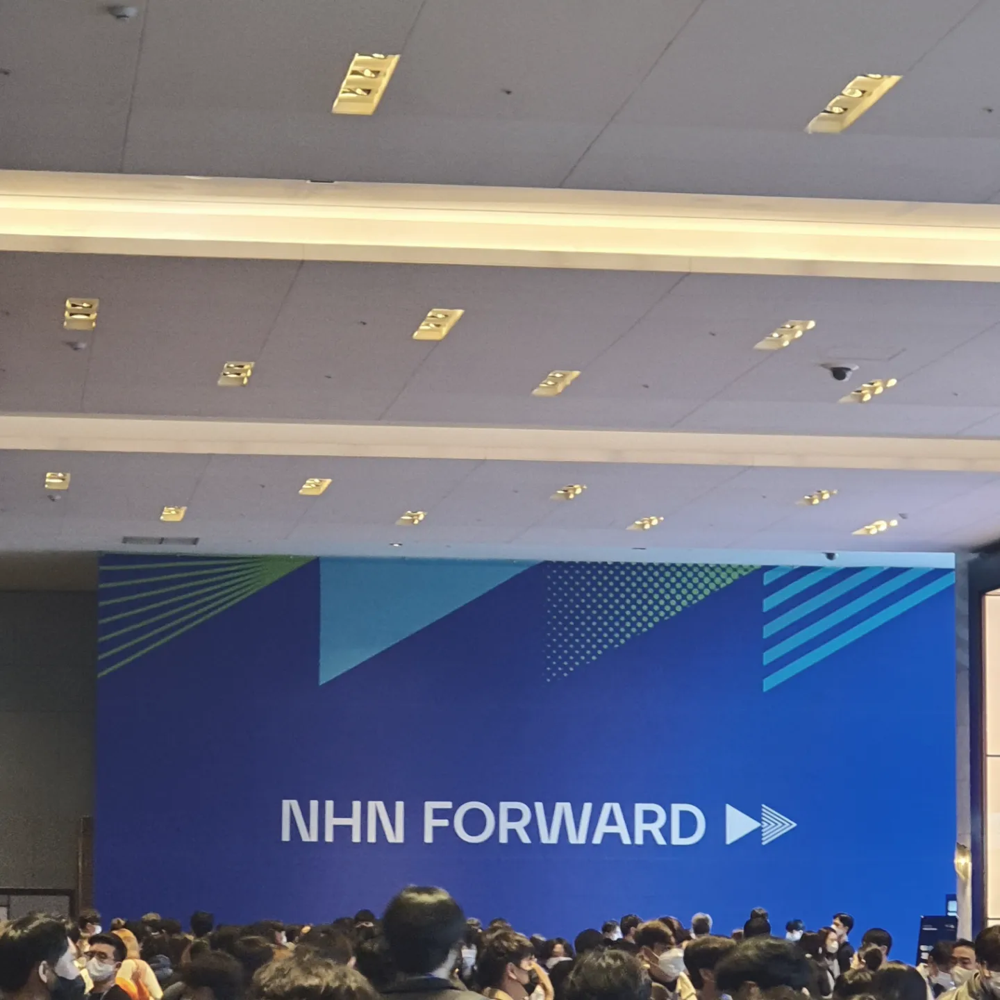
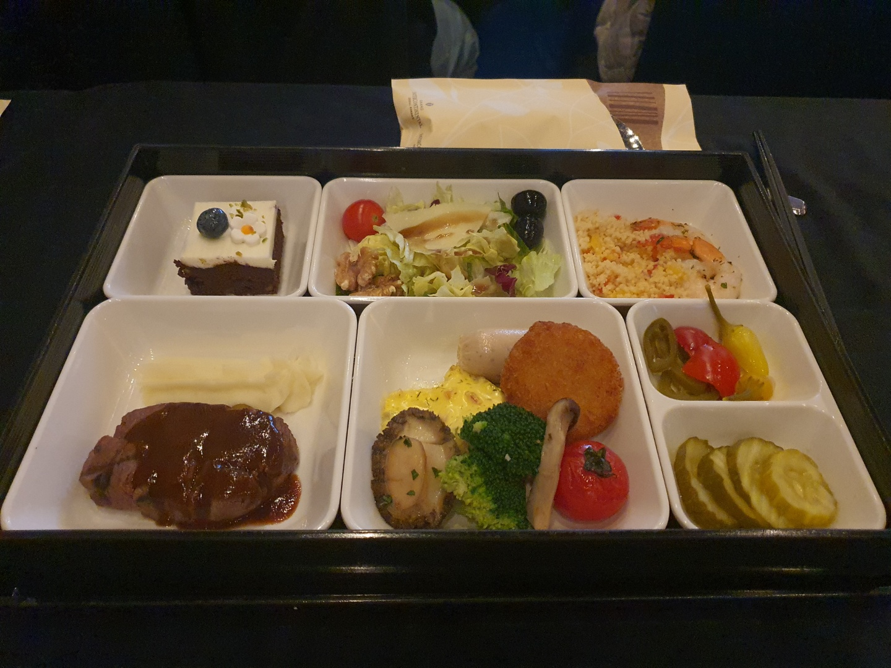

## NHN FORWARD 2022

 

처음으로 오프라인 개발 컨퍼런스에 참여했다.

## keynote

NHN이 가진 AI 인프라, AI 프레임워크, 기술에 대해 소개해주셨다. 
NHN은 판교, 평촌, 내년엔 광주 데이터센터까지 세개의 국가 AI 데이터센터를 갖고있고, 
고성능 GPU Farm, 고성능 컴퓨팅을 실행할 수 있게 해주는 인프라와 
손쉽게 AI 개발 환경을 구성하고 다양한 모델을 훈련, 최적화 할 수 있고 배포부터 운영,관리까지 할 수 있는 프레임워크도 제공할 계획이라고 한다. 

국내 퍼블릭 클라우드 사업자로는 최초로 클라우드네이티브컴퓨팅파운데이션(CNCF);;;(굉장히 길군..)의 ‘쿠버네티스 인증(Certified Kubernetes)’ 자격을 획득했다고 한다.;;;  
아무튼, 쿠버네티스 환경 표준을 준수하고 최신 버전의 서비스를 안정적으로 제공한다는 것을 인증한다고 한다. 
FE 개발 지식을 기대하고 왔는데 데이터, 클라우드, AI 에 대한 NHN의 비전을 보니 그쪽으로도 관심이 생겼다. (관심만..)

 

---

## 들은 거

- 거대한 서비스 쪼개서 마이크로 프론트엔드 만들기
- 구글 사례로 짚어보는 디자인 시스템의 진화
- 괴물 같이 변한 Dooray! 웹앱 정리하기
- 샵바이 주문 검색 성능 개선기
- spring cloud 기반 MSA 환경을 쿠버네티스로 전환하기
- 밑바닥부터 만들어 보는 UI 프레임워크

 

---

## 거대한 서비스 쪼개서 마이크로 프론트엔드 만들기

- 거대한 Monolithic SPA였던 Dooray를 Monorepo로 전환, 마이크로 프론트엔드 아키텍처를 적용하는 과정을 설명했다.
- 마이크로 프론트엔드는 프로젝트의 복잡도 증가를 따라가지 못할때 선택 가능한 대안 중 하나. 유일한 답은 아니다.
- webpack5 Module Federation.

 

---

## 구글 사례로 짚어보는 디자인 시스템의 진화

 

---

## 괴물 같이 변한 Dooray! 웹앱 정리하기

 

---

## 샵바이 주문 검색 성능 개선기

- elastic search engine 적용기.
- DB 동기화.

 

---

## spring cloud 기반 MSA 환경을 쿠버네티스로 전환하기

- 무중단 트래픽 전환.
- 마이크로 서비스와 쿠버네티스.

 

---

## 밑바닥부터 만들어 보는 UI 프레임워크

- observer pattern
- store
- Incremental DOM vs Virtual DOM
- 웹 표준과 자바스크립트 스펙

 

---

## ㅠㅠ

솔직히 못 알아들은거 투성이.. 
개념적인걸 최대한 가져가려고 했고.. 
키워드만 정리한 수준이다... 
그래도 front-end의 방향과 중요시 되는 것들이 어떤건지는 알겠다. 

 
 
